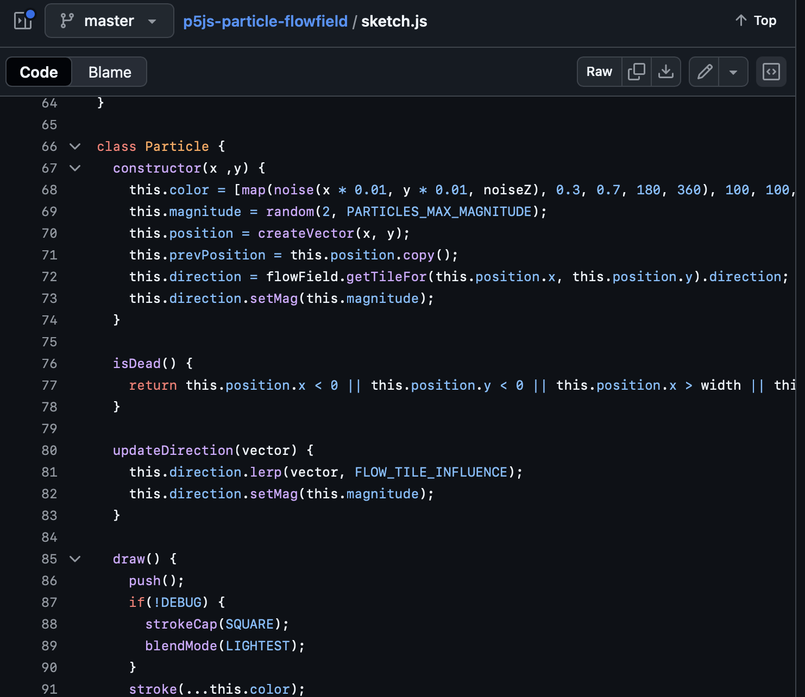
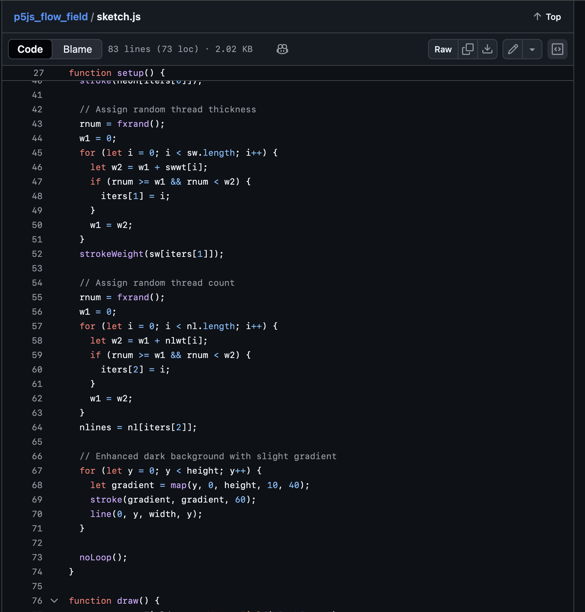

# Quiz-8
Quiz 8 — Particle flow field
Name:Zhuowen Zhao
Student ID:540920479

Part 1: Imaging Technique Inspiration
<<<<<<< HEAD
I am inspired by liquid marbling and glass like refraction. I want the soft, flowing edges, translucent color overlaps, and tiny bubble like highlights that suggest depth. For my assignment I will borrow the idea of a continuously advected color field with a subtle “glass” sheen. This technique suits the brief because it is visually rich yet achievable, a 2D flow to move paint like colors, plus a lightweight refraction/highlight pass. Minimal interaction (mouse or touch) can nudge the flow and generate new compositions in real time. The particle like sparkles add contrast and keep the surface lively.

 or ( )Fluid reference
Source: Unsplash 

 or()Particle reference 
Source: Unsplash

Part 2: Coding Technique Exploration
Technique: This technique in p5.js makes particles move through a flow field shaped by Perlin noise. The particles leave soft trails that look like liquid patterns. By using layers with different colors and opacities, the artwork gains depth and motion, similar to marbling. The random but smooth flow feels natural, like water. Adding brighter “spark” particles creates contrast and energy inspired by the second image. You can change noise scale, particle lifetime, and color blending to create many styles. This method is shown in p5.js particle flow field projects and is easy to adapt.

Technique screenshot
img src=".png>)"
img src=""
img src=""

Example code links
-Particle Flowfield (p5.js): https://github.com/leonlaser/p5js-particle-flowfield  
-Flow Field Generative Art (p5.js): https://github.com/cconsta1/p5js_flow_field  
-WebGL-Fluid-Simulation: https://github.com/PavelDoGreat/WebGL-Fluid-Simulation/blob/master/script.js

